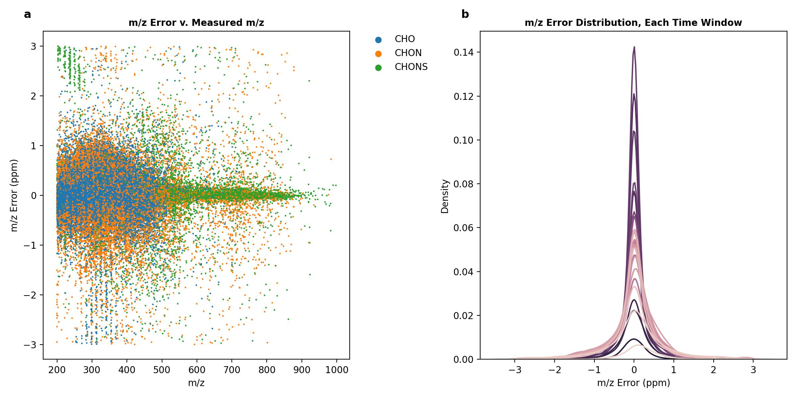
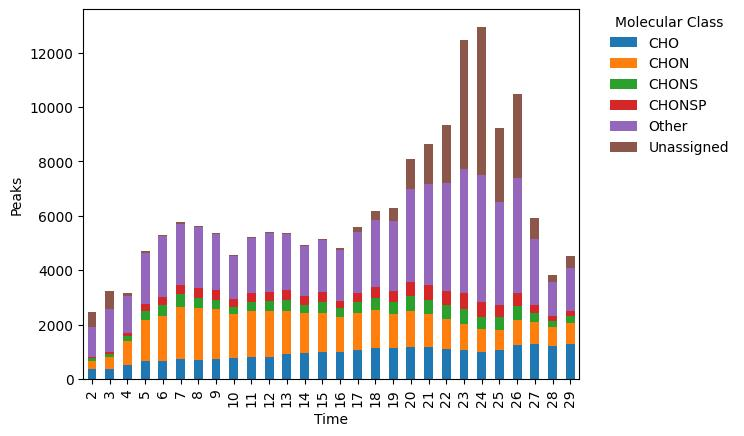

Typical Workflow
================

Here, we outline a typical workflow for using CoreMS and CoreMSTools to process CoreMS assignments of large, multi-sample LC-MS datasets. The overall goal of the workflow is to generate a feature list. A feature list is a list of assignments that are least likely to be erroneous and, importantly, it includes the abundance of these assignments in each sample in the dataset. In addition to including molecular formulas and the intensities, feature lists also typically include - at a minimum - the measured m/z, assignment error, and retention time of each ion.

The steps of a typical workflow can be divided into three groupings. 
    1. Formula assignments 
    2. Quality control
    3. Feature filtering 

Formula assignments 
-------------------

CoreMSTools only works with assignments generated by CoreMS. If you are new to using CoreMS for formula assignments of LC-MS data, check out the CoreMS Primer section. 

Creating an Dataset object
~~~~~~~~~~~~~~~~~~~~~~~~~~~~~~

A Dataset object stores the paths to the individual assignment files, methods that can be applied to each assignment file, and the feature list for the dataset. It requires a sample list assembled by the users, which can be supplied as a Pandas DataFrame, or as a .csv file. 

.. code-block::

    from coremstools.Parameters import Settings
    from coremstools.DataSet import DataSet

    Settings.assignments_directory = "/Volumes/IQX-Data/"

    dset = DataSet(path_to_sample_list = Settings.raw_file_directory + 'sample_list.csv')

Quality control
---------------

Internal standard check
~~~~~~~~~~~~~~~~~~~~~~~

With this assignments object, we can run quality control checks on our internals standard.

.. code-block::

    Settings.internal_std_mz = 678.2915
    Settings.std_time_range = [7,10]
    Settings.time_interval = 2

    dset.run_internal_std_qc()

Running this method produces (a) a plot of the EICs of the internal standard m/z for each sample in the dataset, overlaid on one another; and (b) a histogram of the peak areas for the internal standard in each sample (Figure 1). If the peak area of the internal standard in a given sample exceeds 2 times the standard deviation of the mean peak area, the sample is flagged in the sample list as not passing the quality control test. 

.. raw:: html

   

.. image:: ./images/internal_std.jpg

**Figure 1.** **(a)** Overlain EICs corresponding to the m/z of the internal standard. EICs of the standard are shown for each sample in the dataset (60 samples total). **(b)** Histogram of peak areas of the internal standard EIC in all samples in the dataset. These data were collected on a Orbitrap IQ-X. 

.. raw:: html

   

Examine assignment error distributions
~~~~~~~~~~~~~~~~~~~~~~~~~~~~~~~~~~~~~~

We can also plot the m/z error for each assignment across the mass range, for each sample within the dataset.

.. code-block::

    dset.run_assignment_error_plots(n_molclass = 3)
    
This allows us to evaluate the calibration and whether there is a systematic drift in the data. An example of this is shown in Figure 2. 

.. raw:: html

   

**Figure 2.** **(a)** The assignment error for formulas in the CHO, CHON, and CHOS molecular classes across the mass range in one sample of the dataset. **(b)** Kernel density estimation plots of assignment error for each time-averaged mass spectrum for the same sample.

.. raw:: html

   

Examine retention by molecular class
~~~~~~~~~~~~~~~~~~~~~~~~~~~~~~~~~~~~

Finally, we can examine the number of assignments in a subset (or all) of the possible molecular classes in a dataset, as well as the number of unassigned m/z, across the chromatographic separation. This analysis can reveal potentially problematic time-averaged mass spectra. An example is shown in Figure 3. 

.. code-block::

    dset.run_molclass_retention_plots(n_molclass = 4)

.. raw:: html

   

**Figure 3.** Bar plot showing the number of formulas of each molecular class in each time-averaged mass spectrum across the chromatographic separation of one sample.

.. raw:: html

   

Calculate peak dispersity
-------------------------

After performing quality control checks, we can calculate the chromatographic 'dispersity' metric for individual ions. A value close to zero indicates the ion is chromatographically well-resolved. 

.. code-block::

    dset.run_dispersity_calcs()

The feature list
----------------

Feature alignment
~~~~~~~~~~~~~~~~~

.. code-block::

    dset.run_alignment()

Gapfilling
~~~~~~~~~~

.. code-block:: 

    dset.run_gapfill()

Flagging blank features
~~~~~~~~~~~~~~~~~~~~~~~

.. code-block::

    dset.flag_blank_features()

Exporting the feature list
~~~~~~~~~~~~~~~~~~~~~~~~~~

.. code-block::

    dset.export_feature_list()

Example
-------

.. code-block::
    import warnings
    warnings.filterwarnings('ignore')

    from coremstools.Parameters import Settings
    from coremstools.DataSet import DataSet

    if __name__ == '__main__':
        
        Settings.raw_file_directory = './test/testdata/'
        Settings.assignments_directory = Settings.raw_file_directory
        Settings.internal_std_mz = 678.2915
        Settings.std_time_range = [7,10]
        Settings.time_interval = 2
        Settings.blank_sample_name = '20221103_LBA_Boiteau_Zorbax3p5_qh2o_fullmz'

        dset = DataSet(path_to_sample_list = Settings.raw_file_directory + 'sample_list.csv')

        dset.run_internal_std_qc()

        dset.run_assignment_error_plots()

        dset.run_molclass_retention_plots()

        dset.run_dispersity_calcs()

        dset.run_alignment()

        dset.run_gapfill()

        dset.flag_blank_features()

        dset.export_feature_list()

